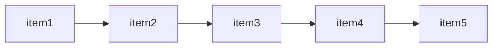

# 进入redis命令交互

无认证模式：

```shell
redis-cli -h <127.0.0.1> -p <6379>
```

带认证模式：

```shell
# 设置认证密码
redis-cli # 进入redis命令交互
config set requirepass <密码> # 设置认证密码

# 使用认证密码进入
redis-cli -h <127.0.0.1> -p <6379> # 进入redis命令交互
auth <password> # 认证密码
```


> 使用 `ctrl + D` 或 `ctrl + C`  或 使用`quit`命令 退出命令交互

# 常用redis命令

## 通用

```shell
keys <pattern> # 得到满足条件的所有的key

exists <keys...> # 确认指定的多个key有几个是存在的

type <key> # 得到key的类型

dbsize # 得到key的数量

ttl <key> # 得到一个key的过期时间, -1表示永不过期，-2表示key不存在

expire <key> <seconds> # 重新设置一个key的过期时间，单位秒

rename <oldkey> <newkey> # 重命名一个key

del <key> # 删除指定的key
```

默认情况下，`redis`会创建`16`个数据库

默认情况下，它会使用`0`号数据库存储键值对，除非有必要，否则不用去修改它

> 不同的数据库之间相互独立，因此可能出现重复的键

```shell
select <index> # 选择一个数据库编号

flushdb # 删除当前数据库的所有key

flushall # 删除所有数据库的所有key
```

## 字符串

```shell
set <key> <value> [<TTL>] # 设置键值对，TTL为过期时间，单位秒，默认为-1，表示永不过期

get <key> # 获取某个键的值

mget <keys...> # 获取多个key的值

incr <key> # 将某个键的值自增1，前提条件是该键的值必须是数字

incrby <key> <number> # 将某个键的值自增指定的数量，前提条件是该键的值必须是数字

decr <key> # 将某个键的值自减1，前提条件是该键的值必须是数字

decrby <key> <number> # 将某个键的值自减指定的数量，前提条件是该键的值必须是数字
```

## list

`redis`中的`list`是一种从左到右的链表结构，左边是链表的头，右边是链表的尾



```shell
rpush <key> <value> # 向指定的key对应的链表尾部加入一个值

lpush <key> <value> # 向指定的key对应的链表头部加入一个值

llen <key> # 得到链表的长度

lrange <key> <start> <end> # 得到链表指定范围的值

lindex <key> <index> # 返回链表key中下标为index的值

lset <key> <index> <value> # 设置链表key下标为index的值

lrem <key> <count> <value> # 删除链表key中值为value的项，删除count个

lpop <key> # 删除链表的首元素

rpop <key> # 删除链表的尾元素
```


## hash

`hash`类型相当于把`redis`的某个值设置为对象

```shell
hset <key> <field> <value> # 设置对象key的属性

hget <key> <field> # 返回对象key的field属性值

hkeys <key> # 返回对象key中所有的键

hvals <key> # 返回对象key中所有的字段值

hgetall <key> # 返回对象key中所有的键值对

hexists <key> <field> # 对象key中是否存在指定的字段

hdel <key> <field> # 删除对象key中的指定字段

hlen <key> # 返回对象key中的字段数量
```

