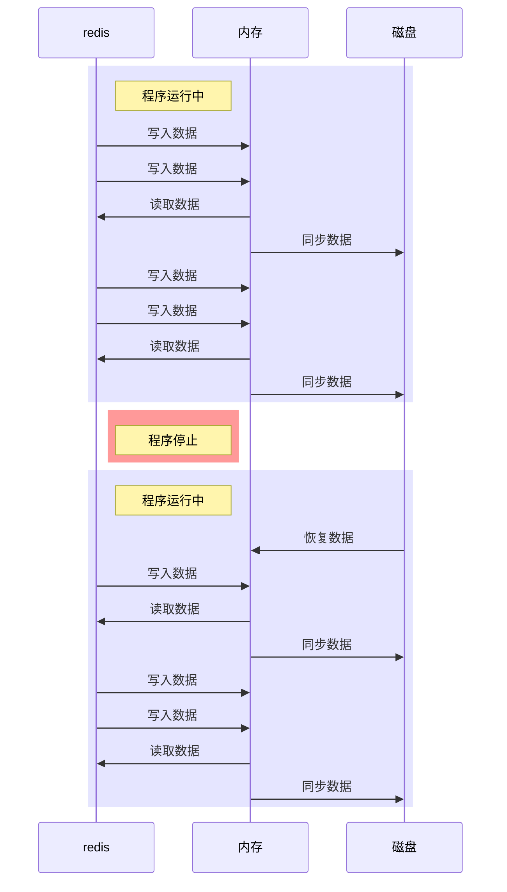
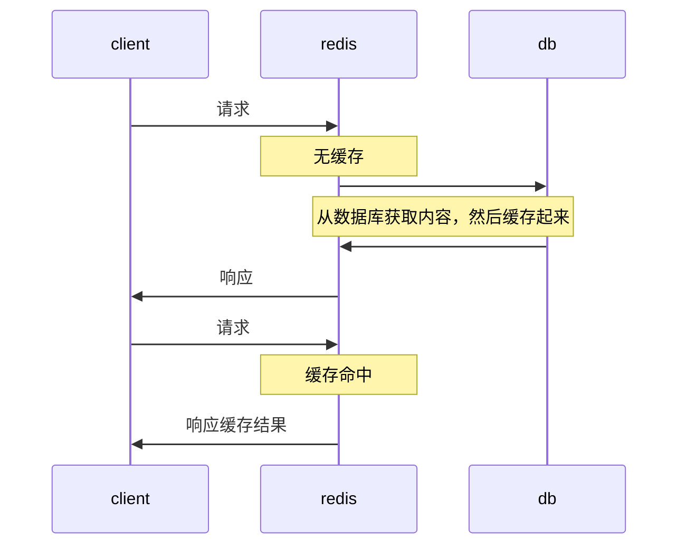

# redis 简介

> 官网：https://redis.io/
>
> 民间中文网：http://www.redis.cn/

`redis`是一个`键值对数据库`，属于`nosql数据库`的一种。

`redis`是开源系统，遵守`BSD开源协议`。

既然是键值对数据库，键自然是不可重复的，而值可以是

- 字符串 `String`，最常用的类型
- 哈希 `Hash`
- 列表 `list`
- 集合 `set` 
- 有序集合 `sorted sets`

有别于其他数据库，`redis`对数据的操作是在内存中完成的，因此：

- `redis`有着超高的读写效率
- `redis`会耗费大量内存，因此往往会搭建`redis`集群来解决内存不足的问题

尽管对数据的操作在内存中完成，但`redis`仍然提供了持久化的功能，在默认情况下，它使用异步的方式将数据写入到硬盘，以便重启之后从硬盘中恢复数据到内存



基于`redis`的这种特点，我们通常用它记录`缓存`



常用服务器结构：


# windows 中安装redis

1. 下载：https://github.com/microsoftarchive/redis/releases
2. 双击安装

# mac 中安装 redis

```shell
brew install redis # 安装redis
brew services start redis # 启动redis
brew services stop redis # 停止redis
brew services restart redis # 重启redis
```


# 可视化工具

 VSCode 插件 `Redis`